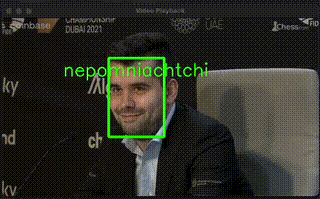

# Encrypted Facial Detection via Homomorphic Encryption in Golang

A client-server system for face prediction using **Fully Homomorphic Encryption (FHE)** with the **CKKS scheme** and **K-Nearest Neighbors (KNN)** for classifying faces. The client handles the video, face detection, feature extraction, and encryption, while the server calculates distances and predicts classes in an encrypted space. 🔒

## Features 🌟

- **Client-Side (Go)**: Detect faces with **YOLO**, extract embeddings with **ResNet**, encrypt via **CKKS**, and send to the server.
- **Server-Side (Go)**: Compute Euclidean distance in the encrypted space using **CKKS** and return predictions to the client.
- **Concurrency**: Go routines for handling multiple faces and speeding things up.
- **Multi-face**: Handles multiple faces per frame.
- **Real-time**: Processes one frame every **1.7 seconds**.
- **Encryption FTW**: Sensitive data stays encrypted the whole time. 🔐

## How It Works 🛠️

1. **Client** captures video, detects faces (YOLO), extracts embeddings (ResNet), and encrypts them with CKKS.
2. **Server** receives encrypted data, calculates distances using encrypted KNN, and sends back encrypted class predictions.
3. **Client** decrypts results and draws bounding boxes with predictions.

## Prerequisites ⚡

- Go 1.18+
- [GoCV](https://github.com/hybridgroup/gocv)
- [Lattigo](https://github.com/tuneinsight/lattigo) for CKKS FHE
- ONNX models for YOLO and ResNet
- Python (for KNN model training)

